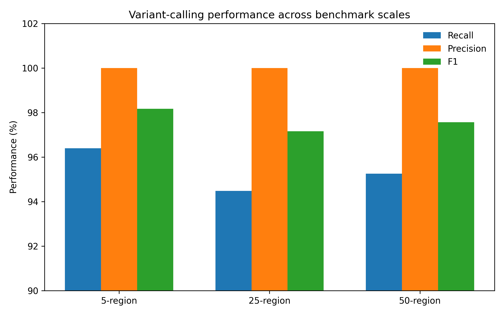

<div align="center">


# Ritika Rajendra Rawat

### Computational Biology · Evolutionary Cancer Genomics · Comparative Genomics · WGS Benchmarking

**Bioinformatics Associate Researcher · Mumbai, India**

I study how evolutionary constraint and genomic variation can help us identify biologically important signals — while keeping the boundary between computational evidence and biological mechanism explicit.

<br>

[**Research Portfolio ↗**](https://rita1791.github.io/ritika_rawat.github.io/) &nbsp;·&nbsp;
[**Academic CV ↓**](assets/cv.pdf) &nbsp;·&nbsp;
[**GitHub ↗**](https://github.com/Rita1791) &nbsp;·&nbsp;
[**LinkedIn ↗**](https://www.linkedin.com/in/ritika-rawat-551107219) &nbsp;·&nbsp;
[**Email**](mailto:ritika@ctrlznow.com)

</div>

---

> ### Visiting from my ECCB 2026 poster?
>
> Welcome. The work I am presenting at ECCB is the current centre of my research:
>
> **Evolutionary Conservation and Functional Constraint of TP53 Mutation Hotspots Across Mammalian Species**
>
> **Poster C-G.32 · Poster Session 3 · ECCB 2026 · Geneva, Switzerland**
>
> The full analysis, processed data, statistics, phylogeny, figures and reproducibility notes are available in the  
> **[TP53 Evolutionary Conservation Across Mammals repository →](https://github.com/Rita1791/TP53-Evolutionary-Conservation-Mammals)**

---

## A short introduction

I am an early-career computational biology researcher with a background that moved from **pharmaceutical analytical sciences and laboratory work into bioinformatics and computational genomics**.

That transition has strongly influenced the way I approach research.

I am interested not only in whether a computational analysis produces a statistically interesting result, but also in questions such as:

- What biological process could generate the pattern?
- Is the comparison scientifically fair?
- What assumptions are built into the analysis?
- Does the result survive a different control or sampling strategy?
- Where does the evidence stop?
- And, ultimately, what would need to be experimentally tested?

My recent work has therefore centred on **comparative cancer genomics, TP53 evolution, sequence conservation, phylogenetics and benchmark-aware genomic variant analysis**.

A recurring idea across my projects is:

> **Computational evidence is most useful when it narrows the biological question rather than pretending to finish it.**

---

# My current research question

The project I am currently most invested in began with an observation that is well known in cancer genomics:

Certain positions in **TP53** are mutated repeatedly across human tumours.

Six canonical residues are especially prominent:

```text
R175   G245   R248   R249   R273   R282
```

These positions are biologically important, but I wanted to look at the problem from another direction.

### What does evolution say about them?

More specifically:

> **Do recurrent human TP53 cancer hotspots occur at residues that are unusually constrained across mammalian evolution?**

Initially that sounds like a simple conservation question.

It is not.

The six hotspots lie inside the TP53 DNA-binding domain, which is itself strongly conserved. Comparing the hotspots with the entire protein would therefore make the result look stronger than it really is.

So the question I eventually cared about became stricter:

> **Are canonical cancer hotspots still unusually conserved when they are compared only with other residues from the same DNA-binding domain?**

That became the core of my current TP53 work.

---

# ECCB 2026 · Flagship study

## Evolutionary Conservation and Functional Constraint of TP53 Mutation Hotspots Across Mammalian Species

**Ritika Rajendra Rawat · Sermarani Nadar · Gursimran Kaur Uppal**

**First and presenting author**

<div align="center">

| 56 mammals | 393 TP53 residues | 6 canonical hotspots | 4,225 human TP53 mutations |
|:---:|:---:|:---:|:---:|
| comparative dataset | human reference | all evaluated | PanCancer dataset |

</div>

### The analysis in one line

```text
Mammalian TP53 sequences
          ↓
        MAFFT
          ↓
Human-coordinate residue mapping
          ↓
Conservation + entropy
          ↓
Canonical hotspots
          ↕
DBD-matched non-hotspots
          ↓
Statistical + permutation testing
          ↓
Phylogenetic sensitivity
          ↓
Human cancer recurrence
          ↓
Biological interpretation
```

---

## The result that matters most to me

All six canonical hotspots were invariant across the 56 mammalian TP53 sequences:

```text
R175    1.000
G245    1.000
R248    1.000
R249    1.000
R273    1.000
R282    1.000
```

Each showed:

```text
majority-residue conservation     1.000
human-residue conservation        1.000
Shannon entropy                   0.000
alignment gaps                    0
```

But **6/6 complete conservation is not the most important result**.

The DNA-binding domain is already highly constrained.

What matters more is the domain-matched test:

<div align="center">

### 1.000 vs 0.934

**Canonical hotspots vs DBD non-hotspot residues**

`Mann–Whitney U = 819.0`  
`one-sided p = 0.0156`  
`Cliff's δ = 0.476`

</div>

I then asked the same question another way:

> If I randomly selected six residues from the TP53 DNA-binding domain, how often would they be as conserved as the actual hotspots?

```text
Observed hotspot mean       1.000
DBD-matched null mean       0.936
Empirical one-sided p       0.0236
```

For me, this is the stronger result:

> **The canonical hotspots remain unusually constrained even against an already-conserved domain-matched background.**

### Explore the evidence

[Research repository](https://github.com/Rita1791/TP53-Evolutionary-Conservation-Mammals) ·
[Research Square preprint](https://doi.org/10.21203/rs.3.rs-9299199/v1)

---

# Does the signal survive changes in mammalian sampling?

A 56-species comparative dataset is not composed of 56 independent evolutionary observations.

Some lineages are represented more heavily than others.

So I repeated the hotspot-versus-DBD comparison after altering the taxonomic composition.

| Sensitivity dataset | Hotspot − DBD difference | p |
|---|---:|---:|
| Full dataset | **+0.066** | **0.0156** |
| No primates | **+0.067** | **0.0196** |
| No rodents | **+0.063** | **0.0245** |
| No primates or rodents | **+0.064** | **0.0316** |
| One species per order | **+0.082** | **0.0355** |

The direction remained positive in every analysis.

I interpret this conservatively:

> The signal is not obviously dependent on one overrepresented lineage, although phylogenetic non-independence is reduced rather than eliminated.

---

# Connecting evolution with human cancer data

I next integrated mammalian conservation with TP53 mutation recurrence from human PanCancer data.

Across all 393 TP53 residues:

```text
Spearman ρ = 0.430
p = 4.49 × 10⁻¹⁹
```

Within the DNA-binding domain:

```text
Spearman ρ = 0.368
p = 1.68 × 10⁻⁷
```

This suggests that residues under stronger mammalian constraint tend to be recurrently mutated more often in human cancer.

But there is an important exception.

### R249

```text
Conservation       1.000
Mutation count        47
Recurrence rank       19
```

R249 is completely conserved, yet it is not among the highest-frequency TP53 mutation positions.

That result prevents me from making a simplistic argument that:

```text
more conservation = more cancer recurrence
```

Instead, my interpretation is:

> **Evolutionary conservation can indicate functional sensitivity, but it does not dictate mutation recurrence.**

Mutational processes, nucleotide context, tumour type, environmental exposure, selection and other biological factors also contribute.

This is why the sentence I use to summarise the study is:

## Conservation supports prioritisation, not causation.

---

# My research portfolio

The projects below are related, but they answer different questions.

---

## 01 · Mammalian TP53 evolutionary constraint

### [TP53 Evolutionary Conservation Across Mammals →](https://github.com/Rita1791/TP53-Evolutionary-Conservation-Mammals)

**Question**

> Are recurrent human TP53 cancer hotspots unusually evolutionarily constrained across mammals?

**What I worked on**

```text
Sequence curation
Multiple-sequence alignment
Human-coordinate mapping
Residue conservation
Shannon entropy
Domain-matched controls
Mann–Whitney testing
Cliff's delta
Permutation analysis
Phylogenetic sensitivity
Cancer recurrence integration
Scientific visualisation
```

**Current research output**

- 56 curated mammalian TP53 protein sequences
- six canonical hotspots
- domain-matched statistical analysis
- TCGA PanCancer/cBioPortal integration
- maximum-likelihood phylogeny
- Research Square preprint
- accepted ECCB 2026 contribution

**What I consider the contribution**

Not simply showing that famous TP53 hotspots are conserved.

The more useful contribution is testing whether those residues remain exceptional **within the already-conserved DNA-binding domain**.

---

## 02 · Human–elephant TP53 mapping

### [Elephant TP53 Hotspot Mapping →](https://github.com/Rita1791/Elephant-TP53-Hotspot-Mapping)

This was the project that led me toward the broader mammalian study.

I began by asking:

> **How do recurrent human TP53 cancer-associated residues map onto elephant TP53 and TP53-related protein sequences?**

The focused exploratory dataset showed strong exact-residue preservation at the six canonical human hotspots despite much greater divergence at the whole-protein level.

The work includes:

```text
protein sequence curation
pairwise alignment
hotspot-coordinate mapping
whole-protein similarity
phylogenetic context
feature exploration
EleProtect research interface
```

This project taught me an important distinction:

> **Exact residue identity is an observation. Functional conservation is a biological interpretation that requires more evidence.**

That distinction changed how I approached the next project.

### Research output

**Comparative In-Silico Mapping of TP53 Mutation Hotspots in Elephants:  
A Responsible Bioinformatics Innovation Contributing to Cancer Research**

First-author published chapter, 2026.

[Explore repository →](https://github.com/Rita1791/Elephant-TP53-Hotspot-Mapping)

---

## 03 · Benchmark-aware WGS variant calling

### [Benchmark-Aware WGS Preventive Genomics →](https://github.com/Rita1791/Benchmark-aware-WGS-preventive-genomics)

This project came from a different problem:

> **What does a high variant-calling benchmark score fail to tell us?**

Using GIAB HG001 / NA12878 and selected GRCh38 chromosome 22 high-confidence regions, I evaluated a short-read small-variant workflow at progressively broader scopes.

```text
5 regions  →  25 regions  →  50 regions
```

The final formal RTG `vcfeval` benchmark produced:

<div align="center">

| Precision | Sensitivity | F-measure |
|:---:|:---:|:---:|
| **99.84%** | **95.10%** | **97.41%** |

</div>

Those numbers looked good.

The error analysis was more useful.

```text
123 normalized truth-only misses

66 deletions
56 insertions
1 SNV
```

### 122 / 123 misses were indels.

That changed the research question from:

> “How accurate is the pipeline?”

to:

> **“Where does the accuracy break?”**

The project includes:

```text
FASTQ QC
fastp preprocessing
BWA-MEM2 alignment
SAMtools
bcftools variant calling
VCF filtering + normalization
bcftools isec
RTG vcfeval
GIAB benchmarking
regional error analysis
```

<p align="center">
  <a href="assets/wgs-benchmark-scales.png">
    
  </a>
</p>

The current study is a **regional analytical validation**, not a claim of complete whole-genome or clinical performance.

[Explore WGS repository →](https://github.com/Rita1791/Benchmark-aware-WGS-preventive-genomics)

---

# How these projects connect

At first glance, evolutionary TP53 analysis and WGS benchmarking may look like different research directions.

For me, they are connected by the same underlying concern:

### How much confidence should we place in a computational result?

```text
                         BIOLOGICAL QUESTION
                                │
                  ┌─────────────┴─────────────┐
                  ▼                           ▼
        Comparative genomics            Genomic variation
                  │                           │
                  ▼                           ▼
        Evolutionary constraint          Variant calling
                  │                           │
                  ▼                           ▼
         Fair biological control       Benchmark truth set
                  │                           │
                  ▼                           ▼
          Sensitivity testing            Error analysis
                  └─────────────┬─────────────┘
                                ▼
                     EVIDENCE-AWARE INFERENCE
                                │
                                ▼
                       TESTABLE BIOLOGY
```

In both cases, I am interested in what happens **after the headline result**.

For TP53:

```text
6 / 6 hotspots are conserved
```

is followed by:

```text
Are they still exceptional against a domain-matched background?
```

For WGS:

```text
F-measure = 97.41%
```

is followed by:

```text
What accounts for the remaining errors?
```

That second question is usually where I find the research more interesting.

---

# Computational ↔ experimental

My research direction is computational, but my first training was experimental.

Before moving deeply into bioinformatics, I trained in **Pharmaceutical Analytical Sciences**.

That background included hands-on experience with:

`TLC` · `HPLC` · `GC` · `UV–Vis` · `DPPH assays` · `sample preparation` · `serial dilution` · `filtration` · `laboratory documentation`

with additional exposure to:

`PCR` · `gel electrophoresis` · `DNA/RNA extraction` · `ELISA` · `protein estimation` · `microscopy`

and guided exposure to:

`FT-IR` · `dissolution testing`

---

## Bachelor's research

### Quantitative determination and antioxidant potential of ferulic acid from foxtail millet

Faculty-supervised research, 2023–2024.

My experimental workflow involved:

```text
Sample preparation
      ↓
TLC identification
      ↓
DPPH antioxidant assay
      ↓
UV–Vis measurement at 517 nm
      ↓
% inhibition
      ↓
IC50 estimation
```

Reported outcome:

```text
IC50 ≈ 78 µg/mL
```

I do not consider my wet-lab background and computational work as two unrelated skill lists.

The connection I am trying to build is:

```text
MEASURE
   ↓
ANALYSE
   ↓
INTERPRET
   ↓
PRIORITISE
   ↓
TEST
```

My current TP53 studies are predominantly in the analysis and prioritisation stages.

Experimental validation is the next evidence layer, not something I claim to have already completed.

---

# Research experience

## Bioinformatics Associate Researcher

**Nainsense Labs Private Limited · NainFit.ai / Ctrlznow**  
**Jul 2026 — Present**

Promoted after completing a Bioinformatics Internship during May–June 2026.

My work includes:

**Computational workflow development**  
Bash/Python short-read genomic workflows from quality control through filtered VCF generation.

**Benchmark-aware validation**  
GIAB benchmarking using normalized VCF comparison and RTG `vcfeval`, followed by regional and variant-class error analysis.

**Research analysis**  
Comparative genomics, sequence conservation, statistical testing and evidence interpretation.

**Scientific communication**  
Figures, technical documentation, workflow diagrams, research summaries and manuscript-related material.

**Scientific translation**  
Communication of genomics and data-driven health workflows to clinical, research and business stakeholders.

---

## Clinical Trial Assistant Intern

**S. P. Mandali's IATRIS**  
**Apr 2024 — Jun 2024**

Worked with clinical-trial documentation, protocol-aware data handling, regulatory records and documentation quality control.

This experience gave me a different appreciation for provenance, traceability and the difference between exploratory analysis and evidence that can support a regulated decision.

---

# Publications & scientific outputs

## 2026 · Research Square preprint

### Evolutionary Conservation and Functional Constraint of TP53 Mutation Hotspots Across Mammalian Species

**Ritika Rajendra Rawat · Sermarani Nadar · Gursimran Kaur Uppal**

First author.

[DOI →](https://doi.org/10.21203/rs.3.rs-9299199/v1)

---

## 2026 · Published book chapter

### Comparative In-Silico Mapping of TP53 Mutation Hotspots in Elephants: A Responsible Bioinformatics Innovation Contributing to Cancer Research

**Ritika Rajendra Rawat · Sermarani Nadar · Gursimran Kaur Uppal**

First author.

[View publication →](https://www.researchgate.net/publication/403581357_COMPARATIVE_IN-SILICO_MAPPING_OF_TP53_MUTATION_HOTSPOTS_IN_ELEPHANTS_A_RESPONSIBLE_BIOINFORMATICS_INNOVATION_CONTRIBUTING_TO_CANCER_RESEARCH)

---

## 2026 · ECCB accepted contribution

### Evolutionary Conservation and Functional Constraint of TP53 Mutation Hotspots Across Mammalian Species

**25th European Conference on Computational Biology · Geneva, Switzerland**

```text
Poster C-G.32
Poster Session 3
First & presenting author
```

[Research repository →](https://github.com/Rita1791/TP53-Evolutionary-Conservation-Mammals)

---

# Methods I actually use

I prefer listing methods rather than assigning myself arbitrary percentage-based skill bars.

### Computational biology

```text
Python
Bash
Linux
R
Jupyter
Biopython
pandas
NumPy
SciPy
Matplotlib
Git
```

### Sequence & comparative genomics

```text
NCBI
UniProt
MAFFT
Jalview
MEGA
sequence curation
residue mapping
conservation analysis
Shannon entropy
phylogenetic analysis
```

### NGS & variant analysis

```text
FASTQ
BAM
VCF
FastQC
MultiQC
fastp
BWA-MEM2
SAMtools
bcftools
RTG vcfeval
GIAB
```

### Statistics

```text
Mann–Whitney U
Cliff's delta
Spearman correlation
permutation testing
empirical null distributions
precision / recall
sensitivity
F-measure
```

### Research practice

```text
data provenance
reproducible workflows
analysis documentation
figure development
literature synthesis
methodological limitation assessment
scientific writing
```

---

# Education

## MSc Bioinformatics

**Guru Nanak Khalsa College · University of Mumbai**  
2024–2026

**CGPA: 8.22 / 10**

My MSc work moved my research direction strongly toward computational genomics, cancer biology and evolutionary analysis.

---

## B.Voc. Pharmaceutical Analytical Sciences

**Ramnarain Ruia Autonomous College**  
2021–2024

**CGPA: 8.57 / 10**

This is where I developed my experimental foundation in analytical chemistry, biological assays and laboratory practice.

---

## Selected scientific training

- SIB Bioinformatics Resources & Tools
- EMBL-EBI / PDBe resources and tools
- SPHN Metadata Catalogue & Interoperability

---

# What I am interested in next

The direction I want to develop further sits around:

```text
evolutionary cancer genomics
comparative genomics
human genomic variation
phylogenetically informed analysis
ancestral reconstruction
protein structure + evolution
genotype-to-phenotype interpretation
evidence-aware computational genomics
```

A question I keep returning to is:

> **Can evolutionary information help us prioritise genomic variation in a way that is statistically defensible, biologically interpretable and ultimately experimentally testable?**

I am especially interested in research environments where computational genomics is connected to **mechanism**, rather than ending with a prediction score.

---

# A note for PIs and researchers

If you arrived here from my poster, CV, conference profile or an application, the three repositories below are the most useful way to inspect my work directly.

| Research | What to inspect | Repository |
|---|---|---|
| **TP53 across mammals** | data curation, statistics, permutation analysis, phylogeny, interpretation | [Open →](https://github.com/Rita1791/TP53-Evolutionary-Conservation-Mammals) |
| **Elephant TP53 mapping** | progression of an earlier research question, sequence mapping, research application | [Open →](https://github.com/Rita1791/Elephant-TP53-Hotspot-Mapping) |
| **WGS benchmarking** | Bash/Python workflow, GIAB validation, error analysis, reproducibility | [Open →](https://github.com/Rita1791/Benchmark-aware-WGS-preventive-genomics) |

I have tried to keep not only the final figures but also the **assumptions, intermediate decisions, limitations and reproducibility gaps** visible in these repositories.

That is intentional.

Research code is rarely as linear as the final figure makes it look.

---

# If we meet at ECCB

My poster is an invitation to discuss more than whether TP53 hotspots are conserved.

The questions I would particularly enjoy discussing are:

**Evolutionary statistics**  
How should residue-level conservation be modelled when species are phylogenetically non-independent?

**Cancer recurrence**  
How can evolutionary constraint be combined with mutational processes rather than interpreted as an isolated predictor?

**Structural biology**  
Can residue-level evolutionary constraint be integrated with structural destabilisation and DNA-contact mechanisms?

**Ancestral reconstruction**  
Can ancestral TP53 states help distinguish deeply conserved functional constraint from lineage-specific effects?

**Variant prioritisation**  
How far can comparative evolutionary information responsibly contribute to interpretation of human genomic variation?

If any of those overlap with your work, I would be very glad to talk.

---

# Research boundaries

I try to make the difference between **what I measured** and **what I infer** visible.

My current work supports computational conclusions such as:

```text
this residue is strongly conserved
this hotspot group differs from its matched background
this association is statistically detectable
this result persists under a sensitivity analysis
this variant caller shows a particular regional error pattern
```

It does not automatically establish:

```text
molecular mechanism
causation
clinical pathogenicity
individual disease risk
treatment response
cross-species functional equivalence
experimental validation
```

For me, being explicit about that boundary does not weaken a computational study.

It defines the next experiment.

---

# Research philosophy

Three principles increasingly shape how I work.

### 01 · Compare against the right background

A result can look impressive simply because the control is too easy.

That is why the TP53 hotspot analysis uses the **DNA-binding domain as the primary biological background**, not only the full protein.

### 02 · Look at the failures

A high benchmark score is useful.

The variants the pipeline misses can be more informative.

That is why my WGS work moved from overall accuracy toward **indel and regional error analysis**.

### 03 · Keep interpretation proportional to evidence

Sequence conservation can identify constraint.

It cannot establish mechanism by itself.

A computational result should make the next biological question sharper, not make the remaining biology disappear.

---

<div align="center">

## Current research trajectory

```text
Experimental foundation
        ↓
Bioinformatics
        ↓
Comparative genomics
        ↓
Evolutionary cancer genomics
        ↓
Evidence-aware genomic interpretation
        ↓
Experimentally testable hypotheses
```

</div>

---

# Let's connect

If you are working on **evolutionary genomics, cancer genomics, TP53 biology, genomic variation, comparative biology or computational methods that connect to experimental questions**, I would be interested in hearing from you.

<div align="center">

[**Official Email**](mailto:ritika@ctrlznow.com) &nbsp;·&nbsp;
[**Personal Email**](mailto:ritika.rawat27@outlook.com) &nbsp;·&nbsp;
[**LinkedIn**](https://www.linkedin.com/in/ritika-rawat-551107219) &nbsp;·&nbsp;
[**GitHub**](https://github.com/Rita1791) &nbsp;·&nbsp;
[**Academic CV**](assets/cv.pdf)

<br><br>

### Ritika Rajendra Rawat

**Computational Biology · Evolutionary Cancer Genomics**

Mumbai, India

<br>

---

### If you scanned this portfolio from my poster:

**Thank you for taking the time to look beyond the figure.**

The part of research I enjoy most usually starts with the question that comes after the result.

**I would be happy to discuss yours.**

</div>
